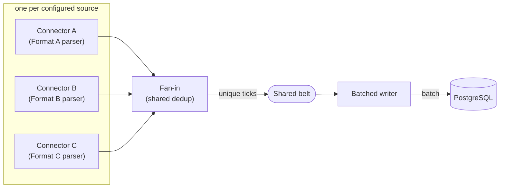
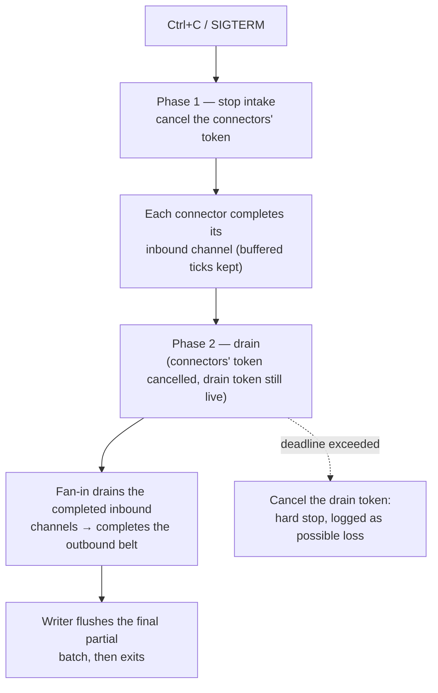

# Aggregator host wiring & graceful drain (Phase F)

The composition root. Everything the earlier phases built in isolation — connectors, fan-in,
deduplicator, batched writer, DB store — is assembled here into one running program that starts
on `dotnet run`, streams live quotes into Postgres, and shuts down cleanly on `Ctrl+C` without
losing the ticks it has already accepted.

Implementation lives in [`../../src/Aggregator/Hosting/`](../../src/Aggregator/Hosting/AggregatorHost.cs)
and the entry point [`../../src/Aggregator/Program.cs`](../../src/Aggregator/Program.cs); the
rationale is in [`../decisions.md`](../decisions.md).

## The assembled pipeline

Each configured source becomes a `WebSocketExchangeConnector` paired with the `IMessageParser`
for its wire format. **Adding a fourth exchange is a new `Sources` entry plus one `case` in the
format switch — no existing code changes** (grading priority #5). The connectors' inbound
channels feed the fan-in; the fan-in owns the shared outbound belt; the batched writer drains it
into the DB store. All the concurrency lives inside those stages (built in phases B–D); this phase
only wires them and governs their **lifecycle**.

## Configuration

`appsettings.json` (bound to `AggregatorOptions`) carries only what an operator actually varies:

- **`Sources`** — name, WebSocket URI and format per exchange.
- **`Database.ConnectionString`** — overridable at runtime by the `TRADING_DB` env var.
- **`DrainTimeout`** — the shutdown budget (see below).

Everything else (batch size, dedup window, channel capacities, backoff) keeps its spec-tuned
code default — no speculative config surface for knobs nobody is turning yet (YAGNI).

The **schema is not created at runtime.** [`../../db/schema.sql`](../../db/schema.sql) is applied by
ops when provisioning the database; the aggregator assumes the `ticks` table exists. If it does not,
the writer's existing retry-then-count-as-dropped policy surfaces the problem loudly rather than the
host silently owning a migration concern.

## Graceful shutdown — a bounded, two-phase drain

This is the heart of the phase (grading priorities #1 and #2). A clean stop must not throw away
ticks that are already sitting in the in-memory channels. The pipeline runner drives shutdown in
two distinct phases, each with its **own** cancellation source:

Why two tokens rather than one:

- **`_intakeCts`** cancels only the connectors. A connector completes its channel exactly once, on
  `RunAsync` exit — never on a socket drop — so cancelling it is a clean "no more input" signal that
  leaves already-buffered ticks readable.
- **`_drainCts`** governs the fan-in and writer. During the drain it stays *live*, so the fan-in
  keeps reading until the (now-completed) inbound channels run dry, then completes the outbound belt;
  the writer sees that completion, flushes its last partial batch, and exits. This is the orderly
  completion cascade the plan calls for: inbound `Complete()` → dedup drains → outbound `Complete()`
  → writer drains.

The whole drain is **bounded**. The host cancels the shutdown token after `DrainTimeout`
(wired through `HostOptions.ShutdownTimeout`); if that fires before the cascade finishes, the runner
cancels `_drainCts` to force the stages to stop. A drain that runs past its budget only happens when
the DB is unreachable, and the writer already treats undrained ticks as *counted, logged* drops —
never a silent loss.

## Observing every background task

The runner starts each stage's `RunAsync` and keeps the `Task`s. A single **supervisor** task awaits
them all: on the expected cancellation path it simply completes, but if any stage faults unexpectedly
it logs the fault and calls `StopApplication()`, so a dead stage tears the whole pipeline down
instead of leaving a half-running system with an unobserved exception. That supervisor task is itself
stored and awaited during shutdown — no fire-and-forget anywhere (hard rule).
