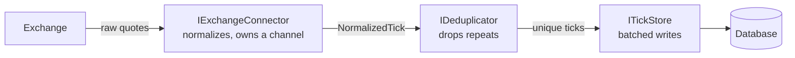

# Core abstractions (Phase A)

Before building any moving parts, Phase A defined the **contracts** the parts plug into — so
each piece can be built, tested, and swapped on its own. Interfaces only, no working code.

Implementation lives in [`../../src/Core/Abstractions/`](../../src/Core/Abstractions/) and the
rationale in [`../decisions.md`](../decisions.md).

## The shape of the pipeline

## The idea in plain terms

- **NormalizedTick** is the common format every quote becomes: *source, ticker, price, volume,
  timestamp*. Each exchange speaks its own wire dialect; everything downstream speaks only this.
- **IExchangeConnector** is "a live source of ticks" — whatever it is inside, it hands out a
  stream of NormalizedTicks.
- **IDeduplicator** answers "is this tick new or a repeat?" (filled in by Phase C).
- **ITickStore** takes a *batch* of ticks and saves them.
- **One real decision:** each connector **owns its own conveyor belt** (a channel) and exposes
  only the read end. The belt's life is tied to the connector *running*, not to any single
  network connection — so a dropped-and-reconnected socket is never mistaken for "stream ended."

Defining these shapes first is what makes "add a new exchange = no rewrite" possible later: a new
exchange is just a new implementation behind the same contracts.
