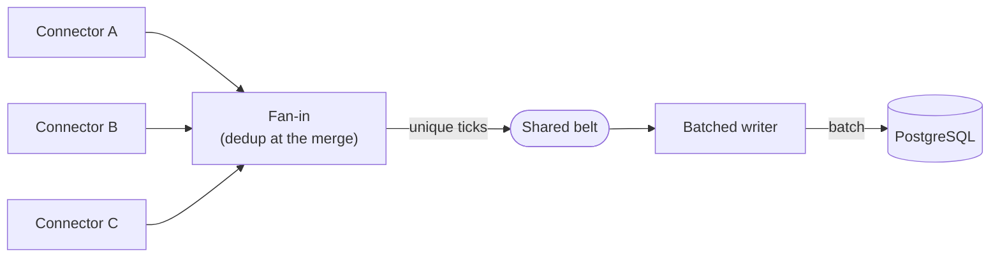
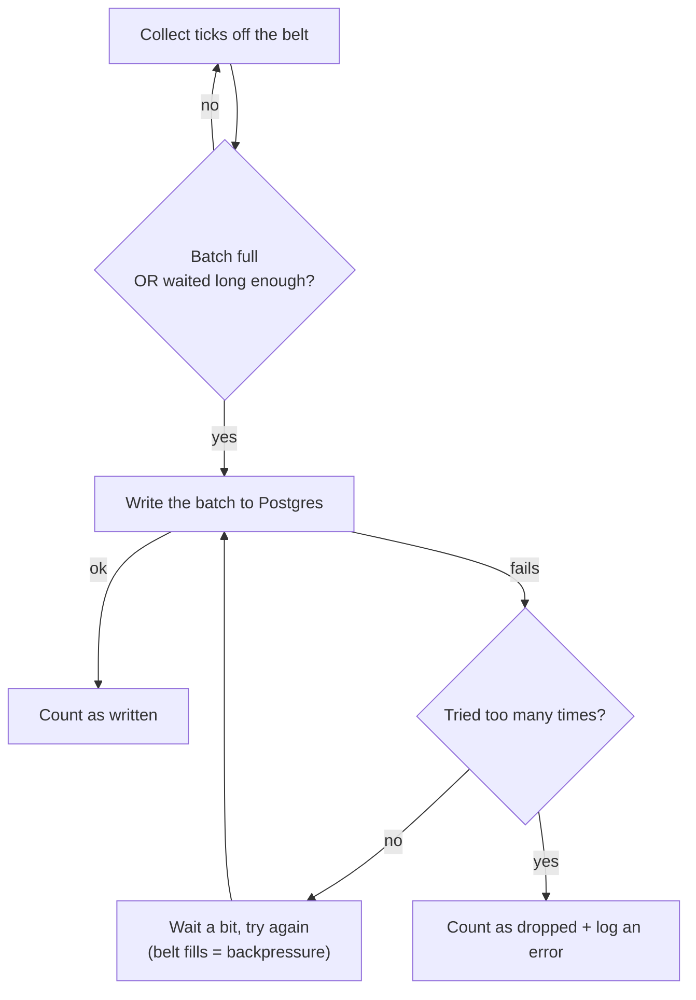

# Fan-in & batched DB writer (Phase D)

The back half of the pipeline: merge every exchange's stream into one, drop duplicates, and save
the survivors to the database in efficient batches — without ever losing data silently when the
database misbehaves.

Implementation lives in [`../../src/Aggregator/Pipeline/`](../../src/Aggregator/Pipeline/FanIn.cs)
and [`../../src/Aggregator/Persistence/`](../../src/Aggregator/Persistence/BatchingTickWriter.cs),
and the rationale in [`../decisions.md`](../decisions.md).

## The shape of this stage

## How a batch is written

## The idea in plain terms

- **Merge many sources into one.** Each connector has its own belt of ticks; the fan-in reads all
  of them at once and pours them onto a single shared belt. One quiet source never holds up a busy
  one — they're read independently.
- **Deduplicate at the meeting point.** A duplicate here is a *re-send from one source* (e.g. a
  quote an exchange repeats after reconnecting) — the source is part of the fingerprint, so the same
  quote from two different exchanges counts as two real observations, not a duplicate. The check
  runs as one **shared, thread-safe** stage that every source passes through, rather than a separate
  checker inside each connector: that keeps connectors focused on transport, uses one memory window
  instead of many, and is exactly the "dedup stays correct while many sources hit it at once"
  property the system is graded on.
- **Save in batches, not one-at-a-time.** Writing every tick individually would hammer the
  database. Instead ticks are grouped and written together, triggered by **either** a full batch
  **or** a short timer — so busy periods write big efficient batches and quiet periods still don't
  leave ticks waiting around.
- **Never lose data quietly.** If a write fails, the batch is retried a few times with growing
  pauses. While it retries, the belts fill up and **push back** on the sources (backpressure), so a
  brief database hiccup costs a little delay but **loses nothing**. Only if the database stays down
  past the retry budget is the batch dropped — and even then it's **counted and logged**, never
  silently discarded.
- **A dumb, swappable database part.** The piece that actually talks to Postgres does one thing:
  write a batch, or throw if it can't. All the "how many retries, when to give up" thinking lives
  one level up — so the database could be swapped out without touching that policy.
