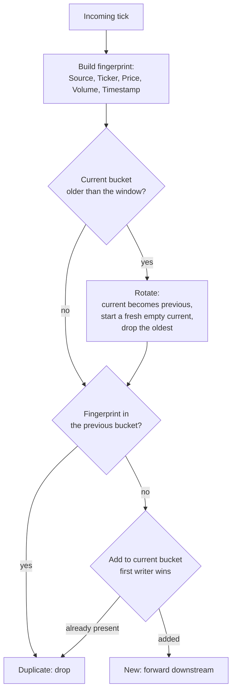

# Deduplicator (Phase C)

Drops exact re-sends of a quote (e.g. quotes an exchange resends after a reconnect) while
staying thread-safe for concurrent sources and keeping memory bounded.

Implementation lives in [`../../src/Aggregator/Deduplication/`](../../src/Aggregator/Deduplication/Deduplicator.cs)
and the rationale in [`../decisions.md`](../decisions.md).

## How one tick is decided

## The idea in plain terms

- **Fingerprint = the dedup key:** source, ticker, price, volume, timestamp. Source is included
  so the same quote from two exchanges is two observations, not a duplicate; price and volume are
  included so two genuine quotes sharing a millisecond are never merged.
- **Check-and-remember in one step.** "Is it new? then remember it" happens as one indivisible
  action, so if two sources offer the same new quote at once, exactly one wins and the other is
  dropped — no race, no lost tick.
- **Two buckets bound memory.** Fingerprints live in a *current* and a *previous* bucket, each
  covering one time window. Both are checked; new ones go into *current*. Once a window passes,
  the oldest bucket is dropped whole — so a quote is remembered for one to two windows, then
  forgotten.
- **Safe rotation.** The two buckets swap as one unit, and the new *previous* reuses the old
  *current*, so a quote added just before a swap is still remembered just after it — no duplicate
  slips through the boundary.
