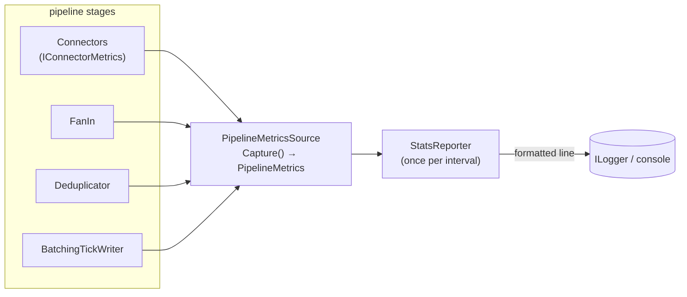

# Monitoring — counters, backpressure gauge & the stats line (Phase G)

The observability layer over the assembled pipeline. Everything downstream of this phase can be
watched live: how fast ticks are arriving, how many were deduplicated, how many reached (or missed)
the database, how full the outbound belt is, and how many sources are currently connected. Nothing in
the concurrency backbone changes — this phase only *reads* counters the earlier stages already keep
and surfaces them.

Implementation lives in [`../../src/Aggregator/Monitoring/`](../../src/Aggregator/Monitoring/); the
rationale is in [`../decisions.md`](../decisions.md).

## What already existed

The counters are not new — each stage has owned its own since the phase that built it:

| Counter | Home | Since |
|---------|------|-------|
| `Received`, `ParseErrors` (per source) | `WebSocketExchangeConnector` | Phase b |
| `TrackedKeys` (dedup window size) | `Deduplicator` | Phase c |
| `Written`, `Dropped` | `BatchingTickWriter` | Phase d |

Structured `ILogger` events for connect / reconnect-with-backoff / idle / connection-error /
parse-error / batch-dropped also already exist from those phases. Phase g adds the few genuinely
missing counters and the periodic rollup that ties them together.

## The genuinely new counters

- **`FanIn.Deduplicated` (and `Accepted`)** — the fan-in is the single place `IDeduplicator.TryAccept`
  runs, so the count of dropped duplicates belongs there (two `Interlocked` longs incremented in the
  pump loop). Nothing counted duplicates before this phase.
- **`FanIn.OutboundCount` / `OutboundCapacity`** — the outbound belt's occupancy versus its bound.
  This ratio is the **backpressure indicator**: a persistently high fill means the DB writer is not
  keeping up with intake.
- **`WebSocketExchangeConnector.IsConnected`** — a single `volatile bool`, set true after a successful
  connect and false in the connection's `finally`. Written only by the connector's own read-loop
  thread and read by the monitor, so `volatile` is sufficient — no lock. Feeds the `conns=up/total`
  figure.

## How the counters are read



- **`IConnectorMetrics`** is the one new abstraction. There are *N* connectors held behind
  `IExchangeConnector`, and a future non-WebSocket connector must stay monitorable, so a read-only
  metrics view justifies its interface (grading #5). It is deliberately kept separate from
  `IExchangeConnector` (ISP): the pipeline depends on the connector's *behaviour*, the monitor on its
  *counters*.
- **Fan-in, deduplicator and writer are singletons** — exactly one instance each, already concrete in
  the composition root with public counter properties. Wrapping them in per-stage interfaces would be
  abstraction for a polymorphism that does not exist, so `PipelineMetricsSource` reads them concretely.
- **`PipelineMetrics`** is an immutable snapshot. Each counter read is individually thread-safe
  (`Interlocked` / `volatile`), so a snapshot is *eventually consistent* across stages with no locking
  on the hot path — perfectly adequate for a human-facing dashboard line.

## The once-per-second stats line

`StatsReporter` is a `BackgroundService`: the host owns its lifecycle and observes its `ExecuteAsync`,
so it satisfies the "no unobserved background task" hard rule with no extra plumbing. Its loop is a
`PeriodicTimer` driven by the injected `TimeProvider`, so the cadence is deterministic under test.

Each tick it captures a snapshot and logs one line built by the pure `StatsLine.Format(previous,
current)` — pure so the rate maths (recv/s from the delta over elapsed time) and the rendering are
unit-testable without a timer:

```
stats recv/s=742 recv=15320 parse=0 dedup=210 written=14980 dropped=0 fill=3% keys=1483 conns=3/3
```

Per-source detail is **not** duplicated onto this line: each connector already logs its own
`received` / `parseErrors` and named connect/disconnect events, so the periodic line stays a readable
aggregate rollup plus the `conns=up/total` health figure.

## Lifecycle — why a separate hosted service

A perpetual stats loop never completes on its own, so folding it into the pipeline runner's
drain-gating `Task.WhenAll` would break the graceful drain (the drain relies on every stage completing
naturally when the channels run dry). Instead the reporter is a **separate** `IHostedService`,
registered **before** the pipeline. Hosted services stop in reverse registration order, so the
reporter keeps printing *through* the whole drain and stops last — you can watch the final batch flush.
The Phase-f two-phase drain in `AggregatorPipeline` is left completely untouched.

The stages are built together from the runtime `Sources` list (so they cannot be registered in DI
individually) yet must be shared between the pipeline and the metrics source. A small
`PipelineComponents` record carries both out of the one composition step that builds them.
