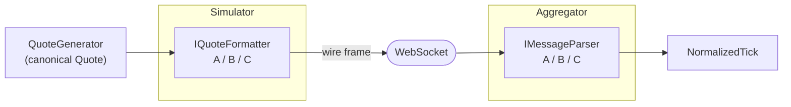
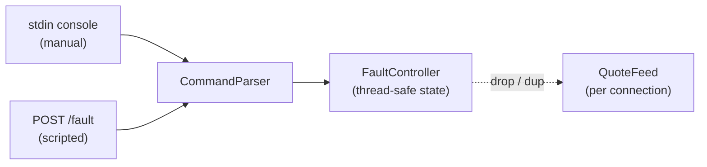

# Exchange simulators & fault control (Phase E)

The front of the test rig: two or three standalone WebSocket "exchanges", each streaming quotes in a
**noticeably different wire format**, each able to inject faults **on command** so the aggregator's
resilience can be exercised on demand.

Implementation lives in [`../../src/Simulators/`](../../src/Simulators/) (the host, feed, formatters
and fault control) with the matching aggregator-side parsers in
[`../../src/Aggregator/Parsing/`](../../src/Aggregator/Parsing/FormatBParser.cs); rationale is in
[`../decisions.md`](../decisions.md).

## Two seams that mirror each other

A new exchange is a new **formatter** here and a new **parser** on the aggregator — and nothing else
changes on either side (grading priority #5). A round-trip test pins the two halves of each format
together.

The three formats differ on every axis the spec asks for — field names, value types, and time
encoding:

| Format | Shape | Fields | Price type | Timestamp |
|--------|-------|--------|-----------|-----------|
| A | JSON object | `symbol,price,size,ts` | number | Unix millis |
| B | JSON object | `s,p,v,t` | **string** | **ISO-8601** |
| C | pipe-delimited | positional | string | **Unix seconds** |

## One fault brain, two ways to drive it

Faults are held in a single thread-safe `FaultController`. A `CommandParser` turns a line of text
into a call on it, and **two thin adapters feed the same parser** — so the manual and scripted paths
can never behave differently, and a new fault is one new case in one place.

## The idea in plain terms

- **Each simulator is one small web server.** Kestrel hosts both the WebSocket quote feed and the
  `POST /fault` control endpoint on a **single port**, so driving it is a plain `curl` and the whole
  thing stays one idiomatic .NET host.
- **Quotes are a random walk.** `QuoteGenerator` round-robins the configured tickers and nudges each
  price a little each step. It's seeded, so a run is reproducible, and it stamps each quote from an
  injectable clock — which keeps it unit-testable with no sockets or timers involved.
- **Rate is a dial, set at start-up.** Three simulators at the default rate add up to the spec's
  500–1000 ticks/s; the feed emits one quote per timer tick. (Batching several quotes per tick, to
  push past the OS timer's ~15ms granularity, is deferred until the Phase h load run shows it's
  actually needed — no sense optimizing a cap we haven't measured.)
- **Faults you can trigger live.** The two the spec names:
  - **`drop`** force-closes the current connection, so the aggregator's reconnect path runs for real.
    It's a simple generation counter: a connection notes the count when it opens and closes once the
    count changes, so the live connection ends while the *next* one starts clean — reconnection always
    succeeds, with no cancellation-token bookkeeping.
  - **`dup on|off`** re-sends each quote immediately, so the aggregator's deduplication has something
    to catch.
  - `status` and `help` round out the console. Richer faults (`garbage`, `pause`/`resume`, a runtime
    `rate` command) are intentionally left for later behind the same seam — each is one new case.
- **Kept deliberately simple.** The spec says the simulators may be simple and not to over-build
  them; the effort went into the parts the aggregator is actually graded on — distinct formats and
  on-demand drop/duplicate faults.
