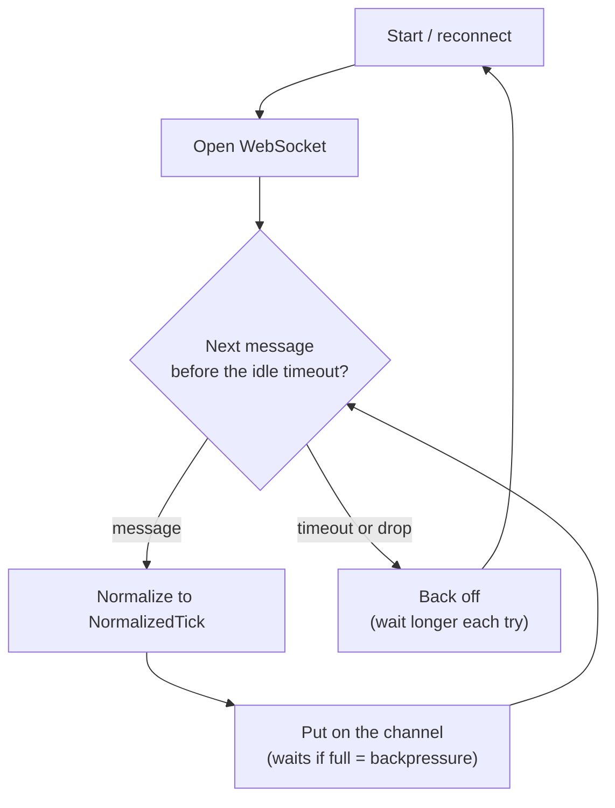

# WebSocket connector (Phase B)

One real connection to an exchange that keeps a steady stream of normalized ticks flowing onto
its channel — and keeps flowing through network trouble.

Implementation lives in [`../../src/Aggregator/Connectors/`](../../src/Aggregator/Connectors/WebSocketExchangeConnector.cs)
and the rationale in [`../decisions.md`](../decisions.md).

## The connect–read–reconnect loop

On shutdown the loop stops and marks the channel finished — so downstream can drain cleanly.

## The idea in plain terms

- **Connect → read → normalize → put.** Open the socket, read each message, turn it into a
  NormalizedTick, and put it on the belt.
- **Reconnect with backoff.** If the line drops, wait and retry — waiting longer each time, up
  to a cap — and keep doing this **repeatedly**, not just once.
- **Notice a hung line.** A socket can look alive but go silent. A timer watches "how long since
  the last message?"; too long, treat it as dead and reconnect. It's armed only while *waiting*
  for data and switched off while *processing*, so a slow downstream is never mistaken for a dead
  line.
- **Only trust a connection that delivers.** The retry patience resets only after a real message
  arrives — so a socket that connects then instantly dies can't trick it into hammering.
- **A fixed-size belt.** If downstream is slow, the belt fills and **pushes back** (backpressure)
  instead of eating unlimited memory. It's marked "finished" only on shutdown — never on a mere
  drop — so a reconnect never looks like end-of-data.
- **Two plug points.** The transport (the socket) and the format parser are separate, swappable
  parts: the reconnect/idle logic is testable with a fake socket, and a new exchange format is
  just a new parser — nothing else changes.
